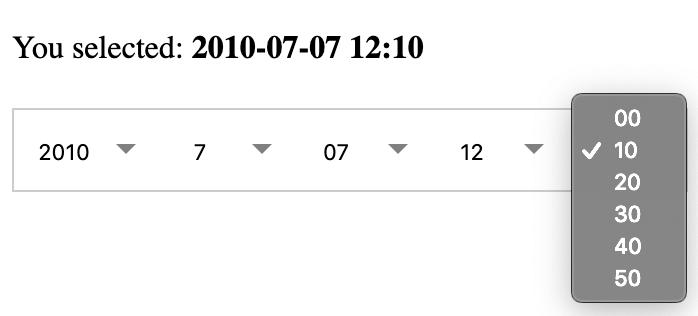

<div style="text-align: center; margin-top: 50px;" >


# Repo Datetime Selector
###### by Repo Tech Team

</div>

## What is it?

_Repo Datetime Selector_ is basically an `HTMLSelectElement` specialized to handle Date and Time written in [VueJS](http://vuejs.org) which can be used in any web page or web application that needs a powerfull yet simple and intuitive way to handle datetime input.

It was build to be used on [RepoTenshoku](https://repotenshoku.com/en) App, aiming to replace datepickers applied to `HTMLInputElements` by Javascript plugins, in order to create a better experience to the end-users in certain specific use-cases.

#### The problem

We've noticed the approach used by these javascript plugins (e.g: [Fengyuanchen Datepicker](https://fengyuanchen.github.io/datepicker/)) works very well on desktop browsers and for cases where the desired date is not far away from the current date time.

However, when it comes to the mobile browsers or when the end-users are required to input a date that has passed way ago (e.g Date Of Birth), the user experience is actually really bad, because the people using your web application over a mobile device won't be able to take advantage of the native selectors.

For such cases, selecting the date parts from dropdown, instead of a datepicker, is an easier and more efficient approach which welps accomplishing the input in a faster way.


#### The solution



_Repo Datetime Selector_ supports many options to create a smooth, highly customizable and transparent solution that work very well for both desktop and mobile devices.

## Get started

We're assuming you're going to use _Repo Datetime Selector_ on your `Javascript` project, using `Node.js`. That said, install it as a dependence to your project.

E.g:
```sh
$ npm install -S https://github.com/repotenshoku/repo-datetime-vue
```

Import it to your project, e.g:

```js
import RepoDatetimeSelector from 'repo-datetime-vue';

// ...

Vue.component(RepoDatetimeSelector);

var app = new Vue({
    el: '#app',
    data() {
        return {
        selectedDate: '',
        months: '1, 2, 3, 4, 5, 6, 7, 8, 9, 10, 11, 12'
        };
    },
    methods: {
        changed(data) {
        console.log('changed', data);
        }
    }
});

// ...
```

Then, add it to your templates, e.g:

```html
<html >

    <!-- ... -->

    <div id="app" >
        <repo-datetime-selector>
    </div>

    <!-- ... -->

</html>
```

## Options

The following attributes are supported:

Attribute | Required | Type | Remark
--------- | -------- | ---- | ------
id | Optional | `String` |
name | Optional | `String` |
value | Optional | `String` | **(rename to value)**
minYear | Optional | `Number` | **(rename to minYear)** Set the minimum year to show in the list
maxYear | Optional | `Number` | **(rename to maxYear)** Set the maximum year to show in the list
stepYear | Optional | `Number` | The interval between consecutive years in the list <br> (e.g. :step="5" ----> ...1995, 2000, 2005, 2010...)
stepMonth | Optional | `Number` | The interval between consecutive months in the list<br> (e.g. :step="3" ----> 01, 04, 07, 10)
stepDay | Optional | `Number` | The interval between consecutive days in the list<br> (e.g. :step="5" ----> 01, 06, 11, ... 31)
stepHour | Optional | `Number` | The interval between consecutive hours in the list<br> (e.g. :step="5" ----> 00, 05,10 ... )
stepMinute | Optional | `Number` | The interval between consecutive minutes in the list<br> (e.g. :step="5" ----> 00, 05 ... 15 ...)
stepSecond | Optional | `Number` | The interval between consecutive seconds in the list<br> (e.g. :step="5" ----> 00, 05 ... 15 ...)
monthNames | Optional | `String` | Comma separated string with month names to be displayed in the month list. E.g Jan, Feb, Mar, ..., Dec
yearSuffix | Optional | `String` | A string attached after the year name, e.g 2000年
monthSuffix | Optional | `String` | A string attached after the year name, e.g 01月
daySuffix | Optional | `String` | A string attached after the year name, e.g 01日
hourClock | Optional | `String` | Default to `24-hour`. Accepts `24-hour` or `12-hour`
outputFormat | Optional | `String` | Default to `y-m-d h:i:s`.
displayFormat | Optional | `String` | Default to `ymdhis`. Defines how the component will looks like in the page. The default shows all available components.
selectClassName | Optional | `String` | Custom class name for styling. 
selectDayClassName | Optional | `String` | Custom class name for styling.
selectMonthClassName | Optional | `String` | Custom class name for styling.
selectYearClassName | Optional | `String` | Custom class name for styling.
selectWrapperClassName | Optional | `String` | Custom class name for styling.
containerClassName | Optional | `String` | Custom class name for styling.
emptyIfNoInput | Optional | `Boolean` | Default to `true`. When true, returns empty string always the end user does not input any value into the fields.

## Events

The following events are triggered:

Event | When | Return
----- | ---- | ------
change | Always a date or time part is selected | Returns a formatted string.

## Get support

Found a bug? Don't worry, we're keen to see it fixed, after all, we also use this in production 😉 ! Please open an [Issue](https://github.com/RepoTenshoku/repo-datetime-vue/issues) and tell us what is going on. Contributions are also very welcome and can be done via [Pull Requests](https://github.com/RepoTenshoku/repo-datetime-vue/pulls). 

Just wanna say hi? Drop a line to [@repotenshoku](https://twitter.com/repotenshoku) on Twitter and show your support 🤘.
